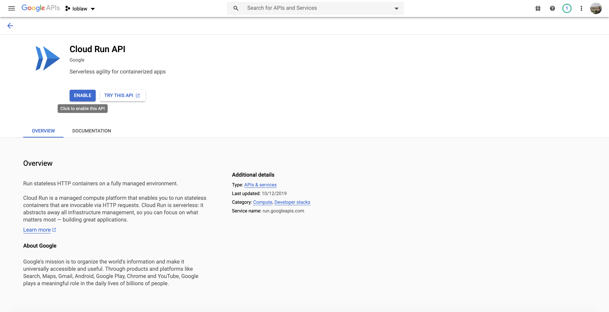

# Terraform gcp scheduler cloudrun

This application will help you in creating gcp cloud run service via terraform. 

### Why to choose - Cloud run for scheduling jobs ? 
While designing applications (specially microservices based) we got into the situation to create some back-office kind utility which 
do some kind of cleaning jobs based on specific schedules. 

To handle such problems developers either create scheduling jobs in some of the microservice or create new module. 
Prefer later one where they could keep adding utilities based on the business domain. In one of my previous project we called it backoffice processor, which used to process some of the operation on 
specific time it could be related to business or could be not. 

For ex: Send customer notifications between 9 am only , data push to start pushing data.
Check some of the best suitable use-casess here. https://cloud.google.com/run#section-10

Here we will set up Cloud Run and scheduler via Terraform. Scheduler will invoke jobs running on cloud run via making secure http call. From security point of view we will enable 
OIDC token 



### Let's build microservice image

```
$ mvn clean install -f report-generator-service/pom.xml
```
#### Create tag image
```
$ docker tag sample-microservice/report-generator-service gcr.io/loblaw-280320-9e0236ac2d5c/report-generator-service
```

### Login to google container registry Tag
```
$ docker login -u _json_key -p "$(cat ./loblaw-280320-9e0236ac2d5c.json)" https://gcr.io
WARNING! Using --password via the CLI is insecure. Use --password-stdin.
Login Succeeded
$ docker push gcr.io/loblaw-280320/report-generator-service:latest


```
### Push docker image
```
$ docker push gcr.io/loblaw-280320/report-generator-service:latest
The push refers to repository [gcr.io/loblaw-280320/ms1]
18872ac8915d: Pushed 
ceaf9e1ebef5: Pushed 
9b9b7f3d56a0: Layer already exists 
f1b5933fe4b5: Layer already exists 
latest: digest: sha256:42d95b4872c1ddb8bd5b8a44ddf8d79f989915b4a1bec7aecbdfd893c6329630 size: 1159
```

## Understand Terraform resource

### Cloud Run  
```
resource "google_cloud_run_service" "weather-service" {
  name     = "report-generator-service"
  location = "us-east4"

  template {
    spec {
      containers {
        image = "gcr.io/loblaw-280320/report-generator-service"
      }
    }
  }

  traffic {
    percent         = 100
    latest_revision = true
  }
}
```

It will create cloud run service report-generator-service , running container will start serving 100% traffic. In case of updation or deployment, previous running 
instance will serve running threads and new up instance will start handling all 100% traffic. We could also manage traffic if require. 

### Create Scheduler job 
````
resource "google_cloud_scheduler_job" "updater" {
  name             = "test-updater"
  description      = "test-updater"
  schedule         = "*/1 * * * *"
  time_zone        = "GMT"

  http_target {
    http_method = "GET"
      uri = "${google_cloud_run_service.weather-service.status[0].url}/v1/weather/hello1"

    oidc_token {
      service_account_email = "terraform@loblaw-280320.iam.gserviceaccount.com"
    }
  }
}
````

#### Initialize 
```
$ terraform init
Initializing the backend...

Initializing provider plugins...

Terraform has been successfully initialized!

You may now begin working with Terraform. Try running "terraform plan" to see
any changes that are required for your infrastructure. All Terraform commands
should now work.

If you ever set or change modules or backend configuration for Terraform,
rerun this command to reinitialize your working directory. If you forget, other
commands will detect it and remind you to do so if necessary.

```

#### Apply changes.
```
ritgirdh$ terraform apply
data.google_compute_default_service_account.default: Refreshing state...
google_cloud_run_service.weather-service: Refreshing state... [id=locations/us-east4/namespaces/loblaw-280320/services/report-generator-service]

An execution plan has been generated and is shown below.
Resource actions are indicated with the following symbols:
  + create
  - destroy

Terraform will perform the following actions:

  # google_cloud_run_service.report-generator-service will be created
  + resource "google_cloud_run_service" "report-generator-service" {
      + id       = (known after apply)
      + location = "us-east4"
      + name     = "report-generator-service"
      + project  = (known after apply)
      + status   = (known after apply)

      + metadata {
          + annotations      = (known after apply)
          + generation       = (known after apply)
          + labels           = (known after apply)
          + namespace        = (known after apply)
          + resource_version = (known after apply)
          + self_link        = (known after apply)
          + uid              = (known after apply)
        }

      + template {

          + spec {
              + serving_state = (known after apply)

              + containers {
                  + image = "gcr.io/loblaw-280320/report-generator-service"
                }
            }
        }

      + traffic {
          + latest_revision = true
          + percent         = 100
        }
    }

  # google_cloud_run_service.weather-service will be destroyed
  - resource "google_cloud_run_service" "weather-service" {
      - id       = "locations/us-east4/namespaces/loblaw-280320/services/report-generator-service" -> null
      - location = "us-east4" -> null
      - name     = "report-generator-service" -> null
      - project  = "loblaw-280320" -> null
      - status   = [
          - {
              - conditions                   = [
                  - {
                      - message = "Image 'gcr.io/loblaw-280320/gcr.io/loblaw-280320/report-generator-service' not found."
                      - reason  = "ContainerMissing"
                      - status  = "False"
                      - type    = "Ready"
                    },
                  - {
                      - message = "Image 'gcr.io/loblaw-280320/gcr.io/loblaw-280320/report-generator-service' not found."
                      - reason  = "ContainerMissing"
                      - status  = "False"
                      - type    = "ConfigurationsReady"
                    },
                  - {
                      - message = "Image 'gcr.io/loblaw-280320/gcr.io/loblaw-280320/report-generator-service' not found."
                      - reason  = ""
                      - status  = "Unknown"
                      - type    = "RoutesReady"
                    },
                ]
              - latest_created_revision_name = "report-generator-service-q75zs"
              - latest_ready_revision_name   = ""
              - observed_generation          = 1
              - url                          = ""
            },
        ] -> null

      - metadata {
          - annotations      = {
              - "serving.knative.dev/creator"      = "terraform@loblaw-280320.iam.gserviceaccount.com"
              - "serving.knative.dev/lastModifier" = "terraform@loblaw-280320.iam.gserviceaccount.com"
            } -> null
          - generation       = 1 -> null
          - labels           = {
              - "cloud.googleapis.com/location" = "us-east4"
            } -> null
          - namespace        = "loblaw-280320" -> null
          - resource_version = "AAWoJCrwjJA" -> null
          - self_link        = "/apis/serving.knative.dev/v1/namespaces/51523235489/services/report-generator-service" -> null
          - uid              = "202c7aa5-d61c-47bf-a1d7-52ab164c1265" -> null
        }

      - template {
          - metadata {
              - annotations = {
                  - "autoscaling.knative.dev/maxScale" = "1000"
                } -> null
              - generation  = 0 -> null
              - labels      = {} -> null
            }

          - spec {
              - container_concurrency = 80 -> null

              - containers {
                  - args    = [] -> null
                  - command = [] -> null
                  - image   = "gcr.io/loblaw-280320/gcr.io/loblaw-280320/report-generator-service" -> null

                  - resources {
                      - limits   = {
                          - "cpu"    = "1000m"
                          - "memory" = "256Mi"
                        } -> null
                      - requests = {} -> null
                    }
                }
            }
        }

      - traffic {
          - latest_revision = true -> null
          - percent         = 100 -> null
        }
    }

  # google_cloud_scheduler_job.updater will be created
  + resource "google_cloud_scheduler_job" "updater" {
      + description = "test-updater"
      + id          = (known after apply)
      + name        = "test-updater"
      + project     = (known after apply)
      + region      = (known after apply)
      + schedule    = "*/1 * * * *"
      + time_zone   = "GMT"

      + http_target {
          + http_method = "GET"
          + uri         = (known after apply)

          + oidc_token {
              + service_account_email = "terraform@loblaw-280320.iam.gserviceaccount.com"
            }
        }
    }

Plan: 2 to add, 0 to change, 1 to destroy.

Do you want to perform these actions?
  Terraform will perform the actions described above.
  Only 'yes' will be accepted to approve.

  Enter a value: yes

google_cloud_run_service.weather-service: Destroying... [id=locations/us-east4/namespaces/loblaw-280320/services/report-generator-service]
google_cloud_run_service.report-generator-service: Creating...
google_cloud_run_service.weather-service: Destruction complete after 2s
google_cloud_run_service.report-generator-service: Still creating... [10s elapsed]
google_cloud_run_service.report-generator-service: Still creating... [20s elapsed]
google_cloud_run_service.report-generator-service: Still creating... [30s elapsed]
google_cloud_run_service.report-generator-service: Creation complete after 35s [id=locations/us-east4/namespaces/loblaw-280320/services/report-generator-service]
google_cloud_scheduler_job.updater: Creating...
google_cloud_scheduler_job.updater: Creation complete after 5s [id=projects/loblaw-280320/locations/us-east4/jobs/test-updater]

Apply complete! Resources: 2 added, 0 changed, 1 destroyed.

Outputs:

url = https://report-generator-service-bmgsrd6uza-uk.a.run.app
 
```

#### Destroy 
```
terraform destroy
```
